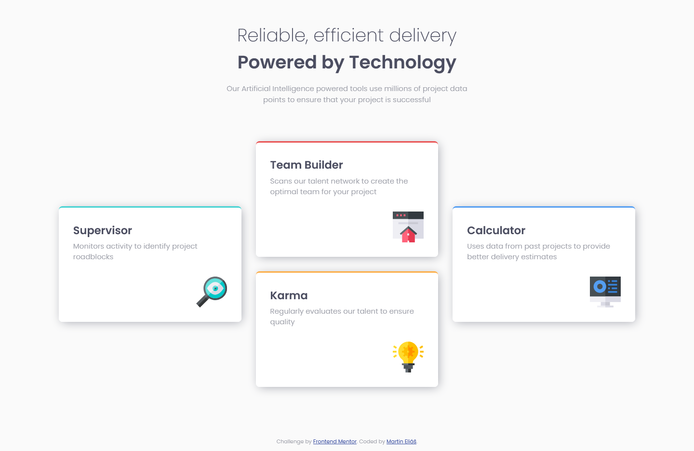
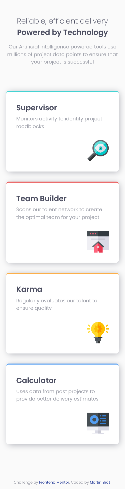

# Frontend Mentor - Four card feature section solution

This is a solution to the [Four card feature section challenge on Frontend Mentor](https://www.frontendmentor.io/challenges/four-card-feature-section-weK1eFYK). Frontend Mentor challenges help you improve your coding skills by building realistic projects. 

## Table of contents

- [Overview](#overview)
  - [The challenge](#the-challenge)
  - [Screenshot](#screenshot)
  - [Links](#links)
- [My process](#my-process)
  - [Built with](#built-with)
  - [What I learned](#what-i-learned)
- [Author](#author)

## Overview

### The challenge

Users should be able to:

- View the optimal layout for the site depending on their device's screen size

### Screenshot

### Links

- Solution URL: [https://www.frontendmentor.io/solutions/four-card-feature-with-grid-flexbox-and-responsiveness-q10kwKwys](https://www.frontendmentor.io/solutions/four-card-feature-with-grid-flexbox-and-responsiveness-q10kwKwys)
- Live Site URL: [https://four-card-feature-section-master-ten-indol.vercel.app/](https://four-card-feature-section-master-ten-indol.vercel.app/)

## My process

### Built with

- Semantic HTML5 markup
- CSS custom properties
- CSS variables
- Flexbox
- CSS Grid
- Mobile-first workflow

### What I learned

I have learned to use CSS styling shadow-box and grid-area.

## Author

- LinkedIn - [LinkedIn](https://www.linkedin.com/in/martin-eli%C3%A1%C5%A1-455550209/)
- Frontend Mentor - [@smradupan](https://www.frontendmentor.io/profile/smradupan)
